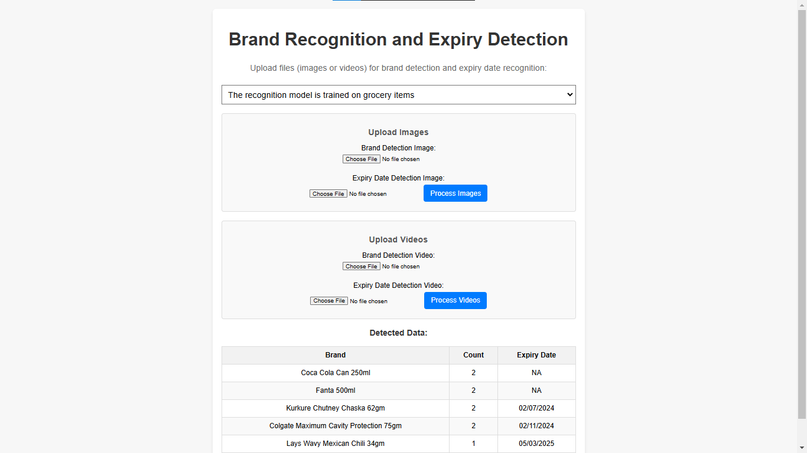

# Flipkart GRiD 6.0 Robotics Challenge - SMART VISION

## **Project Overview**
This project aims to address the requirements of the Flipkart GRiD 6.0 Robotics Challenge by building a robust real-time system capable of:
- Brand detection
- Expiry date extraction
- Item counting
- Freshness detection

The system uses live camera input, processes the captured frames, and meets the performance benchmarks for real-world applicability.

---

## How This Project Works

### The index page has 3 links:

1. Leads to a web page where we can perform brand detection, counting, and expiry detection.
2. Leads to a web page for freshness detection.
3. Leads to a web page that displays the data stored in the database hosted on Render.

###  UI

  

## Task 1: Brand Detection, Counting, and Expiry Date Identification

### Overview:
Task 1 allows users to upload images or videos containing branded items. The system detects the brands, counts their occurrences, and extracts the expiry dates from the provided images or videos.

### UI for Inputs and Output:
- **Before Output:**
  Users can upload two images or two videos :
  1. **Brand Detection Image or Video**: This image/video is used for detecting brands and counting occurrences.
  2. **Expiry Date Detection Image or Video**: This image/video is used for extracting expiry date information via Optical Character Recognition (OCR).
  
- **After Output:**
  Once the images/videos are processed, the results will be displayed in the format  "Brand-Count-Expiry," which includes the following details:
  - Detected brands and their counts
  - Extracted expiry dates
 ### Database Storage:
 
  The data is also stored in a PostgreSQL database hosted on Render. The format of the data in the database is as follows:
  - **Sl No**  
  - **Timestamp**  
  - **Brand**  
  - **Expiry Date**  
  - **Count**  
  - **Expired**  
  - **Expected Life Span (Days)**  

  The results for images and videos are stored with the same processing pipeline.

### Backend Process:
- **For Images:**
  The system uses two images:
  1. **Brand Detection:**  
     The application uses the Roboflow model API to detect brands in the first image. The API URL is:
     ```python
     api_url = "https://detect.roboflow.com"
     result = CLIENT.infer(image_b64, model_id="grocery-dataset-q9fj2/5")
     ```
     This API call performs object detection to identify brands and counts their occurrences in the image.
  
  2. **Expiry Date Detection:**  
     The system uses OCR techniques to extract expiry dates from the second image. The OCR model detects expiry date formats (MM/YY, DD-MM-YYYY) and extracts the relevant information.

  Once the brands and expiry dates are detected, the system maps each brand with its corresponding expiry date and displays the result on the webpage in the format "Brand Count Expiry." The results are also saved in the database.

- **For Videos:**
  The same process applies to videos:
  - Users upload a video, and the system processes each frame for brand detection, counting, and expiry date extraction.
  - The results are then mapped similarly to the image results and displayed on the webpage.
  - The video results are also stored in the PostgreSQL database in the same format as the image results.

###  UI (Before and After Output):
- **Before Output:**  
  Users will see options to upload two images/videos (one for brand detection and one for expiry date detection).
  
  

- **After Output:**  
  The output displays the results under "Brand Count Expiry" along with the data saved in the database.
  
  


## Task 2: Freshness Detection

### Overview:
Task 2 allows users to upload an image or a video containing fresh produce. The system analyzes the freshness of the produce using machine learning models and provides a freshness value.

### Backend Process:
- **For Images:**
  The freshness detection model processes the image and returns a freshness value. 
  After obtaining the result, the system performs some additional processing and then returns the "Produce-FreshnessValue."

  The result is displayed on the webpage in the foramt "Produce-FreshnessValue," and the data is stored in the database.

- **For Videos:**
  The same process applies to videos:
  - Users upload a video, and the system processes the video for freshness detection frame by frame.
  - The result is calculated and returned for the entire video as a "Produce-FreshnessValue."
  - The data is stored in the PostgreSQL database, similar to the image process.

### Database Storage:
The data for both images and videos is stored in the PostgreSQL database in the following format:
- **Sl No**
- **Timestamp**
- **Produce Freshness**
- **Expected Life Span (Days)**

### Example UI (Before and After Output):
- **Before Output:**
  Users will see an option to upload either an image or a video for freshness detection.

  

- **After Output:**
  The output displays the calculated "Produce Freshness Value."

  


## Task 3: View Database

### Overview:
Task 3 leads to a webpage that displays the stored data from the PostgreSQL database for both Task 1 (Brand Detection, Counting, & Expiry Detection) and Task 2 (Freshness Detection). The data is presented in the following formats:

- **Task 1 Data** (Brand Detection, Counting, & Expiry Detection):
  - **Sl No**
  - **Timestamp**
  - **Brand**
  - **Expiry Date**
  - **Count**
  - **Expired**
  - **Expected Life Span (Days)**

- **Task 2 Data** (Freshness Detection):
  - **Sl No**
  - **Timestamp**
  - **Produce Freshness**
  - **Expected Life Span (Days)**

The webpage provides an easy-to-read display of all the results stored in the database, allowing users to track and view previous task outputs.

###  UI:
The database page will display a table with data in the above formats for both Task 1 and Task 2.

  


---

## Project Structure

The project directory is organized as follows:

```plaintext
FLIPKART/
│
├── app.py               # Main Flask application
├── BrandAndExpiry.py     # Logic for brand and expiry detection
├── brand_products.py     # Helper for brand-related functionalities
├── database.py           # Database connection and storage
├── expiry.py             # Expiry detection logic
├── freshness_detection.py # Logic for freshness detection
├── view.py               # Logic to display the data in database
├── requirements.txt      # Python dependencies
├── README.md             # Project documentation
│
├── inputs/               # Input files (images/videos)
├── static/               # Static assets (CSS, processed files, and uploads)
│   ├── styles.css        # Application styles
│   ├── processed/        # Processed output files
│   └── uploads/          # Uploaded input files
│
├── templates/            # HTML templates
│   ├── index.html        # Homepage with navigation
│   ├── task1.html        # Task 1 input and result
│   ├── task2.html        # Task 2 input and result
│   └── database.html     # Displays database records
│
├── images/               # images of the UI
|
└── __pycache__/          # Compiled Python files
```


### Description of Key Directories and Files
- **`app.py`**: The main entry point for running the application.
- **`BrandAndExpiry.py`**: Contains logic for detecting brands and expiry dates.
- **`freshness_detection.py`**: Handles image and video processing for freshness detection.
- **`database.py`**: Manages interactions with the PostgreSQL database.
- **`templates/`**: Includes HTML templates for rendering web pages.
- **`inputs/`**: Stores input files such as images and videos.
- **`static/`**: Holds static files like CSS and processed outputs.

---

## Technologies Used

The following technologies and libraries are used in this project:

### Programming Language
- **Python**: Core programming language for backend logic and functionality.

### Web Development
- **Flask**: For building the web application and routing.
- **HTML/CSS**: For creating web templates and styling.

### Data Processing
- **OpenCV**: For image and video processing (e.g., freshness detection).
- **NumPy**: For numerical computations.

### Machine Learning Models
- **Roboflow API**: For integrating pre-trained models to handle tasks such as object detection and image classification.

### Optical Character Recognition (OCR)
- **OCR Technology**: Used for detecting and extracting expiry date information from images and videos.

### Database
- **PostgreSQL (Render)**: Cloud-hosted database service for managing and storing application data.


---

## Project Setup

Follow the steps below to set up the project on your local machine:

### Prerequisites
Ensure you have the following installed:
- Python 3.10 or above
- pip (Python package manager)
- PostgreSQL database
- Render account (for hosting PostgreSQL database)
- Access to Roboflow API

### 1. Clone the Repository
Clone the project repository to your local machine:
```bash
git clone <repository-url>
cd FLIPKART
```

### 2. Set Up a Virtual Environment
Create and activate a virtual environment:

````python -m venv venv
source venv/bin/activate       # On Linux/Mac
venv\Scripts\activate          # On Windows
````

### 3. Install Dependencies
Install the required Python packages:

```
pip install -r requirements.txt
```


### 4. Configure the Database
Set up a PostgreSQL database on Render.
Note down the database URL (e.g., `postgresql://<username>:<password>@<host>:<port>/<database>`).
Create a `.env` file in the project directory and add the following environment variable:

```
DATABASE_URL=postgresql://<username>:<password>@<host>:<port>/<database>
```

### 5. Configure the Roboflow API
Obtain an API key from Roboflow.
Add the following to the .env file:
```
ROBOFLOW_API_KEY=<your-api-key>
```

### 6. Run the Application
Start the Flask application:
```
python app.py
```


---

## **Contributors**
- Veera Venkata Karthik Barrenkala  - Team Leader - [LinkedIn](https://www.linkedin.com/in/your-linkedin-username)

- Ashok Kumar Malineni  - Team Member -  [LinkedIn](https://www.linkedin.com/in/ashok-kumar-malineni-4974872ab)

